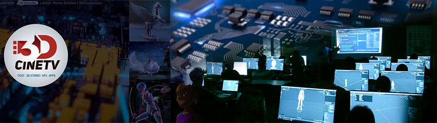

### 3D Animator & VFX compositor @3DCinetv for commercial advertisement, educational videogames, cinema and AR Lens authoring

<a href="https://3dcinetv.com/blog"><strong>BLOG</strong></a> | 
<a href="https://behance.net/3dcinetv"><strong>PORTFOLIO</strong></a> | <a href="https://vimeo.com/3dcinetv"><strong>REELS</strong></a> | <a href="https://youtube.com.com/activemotionpictures"><strong>YOUTUBE</strong></a> | <a href="https://www.instagram.com/3dcinetv/channel/"><strong>IG TV</strong></a>

- 🔭 I’m currently working on Realtime Stylized Shaders in Blender
- 🌱 I’m currently learning PCBs DIY and Arduino One
- 👯 I’m looking to collaborate on 3D avatar facial tracking technical reviews
- 🤔 I’m looking for help with PCB flex screens
- 💬 Ask me about CGI 3D+2D workflow integration
- 📫 How to reach me: 3dcinetv(a) gmail (dot) com
- 🎮 Gaming: GranBlue Fantasy Versus
- ⚡ Fun fact: Mitocondriac functions are actually driven by RNA

My name is Pierre Schiller, I am a 3D Animator & VFX Compositor with 20+ years of experience in commercial advertisement, videogames, and VFX for cinema using a variety of software including Softimage, After Effects, Lustre, Flame, among others.

I’ve also worked as a Blender Foundation Certified Trainer in the last 4 years doing live and online workshops about sculpting, 2d grease pencil animation, and 3D experiences with 360º, AR, and VR for Snapchat and Spark lens filters using Blender.

Check my <a href="https://3dcinetv.com/blog"><strong>BLOG</strong></a> for more information about how I integrate Blender and other software for 2D and 3D workflows.
You can also reach me for more technical-advanced questions in Blender Stack Exchange (Click my stats card below):  

